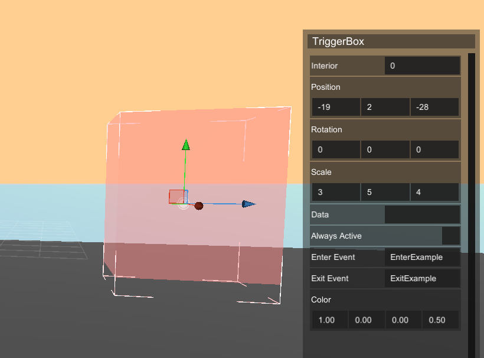
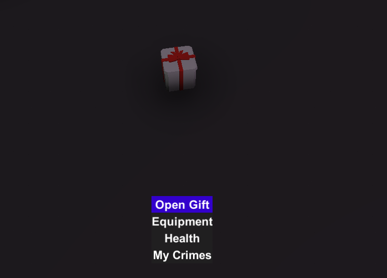

# Custom Events
This allows developers to create their own custom events and triggers for their plugins. `CustomTarget` can be used to trigger different actions of a player, such as entering in a trigger, doing certain actions, etc... For example, a developer could create a custom event that is triggered when a player click on a button, or when they enter a specific area of the world.

```cs
[CustomTarget]
public void OnExampleEvent()
{
  Debug.Log("Example event!");
}
```

# Using triggers
A `TriggerBox` provides two ways of triggering an event, `Enter Event` and `Exit Event`. In order to use the TriggerBox we need to give the name of an event, for example `EnterExample` and also `ExitExample`.  



`public void NameOfTriggerEvent(Serialized trigger, ShPhysical physical)` We are going to use this for the `CustomTarget` in the example we're going to send a message to the player when the player enters or exits the `TriggerBox`

[](src/TriggerBox.mp4 ':include :type=video controls width=100%')

```cs
public class TriggerBoxEvents : IScript
{
    [CustomTarget]
    public void EnterExample(Serialized trigger, ShPhysical physical)
    {
        if (physical is ShPlayer player)
        {
            player.svPlayer.SendGameMessage("You have entered in the trigger box");
        }
    }
    [CustomTarget]
    public void ExitExample(Serialized trigger, ShPhysical physical)
    {
        if (physical is ShPlayer player)
        {
            player.svPlayer.SendGameMessage("You have exited the trigger box");
        }
    }
}
```

# Using EventActions in Entities

We can use this events for showing menus, interacting with the player, interacting with the entity, etc... This actions can be added to an entity with `SvAddDynamicAction()` or add it through Unity.

In this example we're going to make an object with an action and through code we're going to send a message to the player, give money to the player and then delete/destroy the entity.

[](src/EntityEvents.mp4 ':include :type=video controls width=100%')

```cs
public class PlayerEventAction : IScript
{
    [CustomTarget]
    public void OpenGiftEvent(ShEntity entity, ShPlayer caller)
    {
        caller.svPlayer.SendGameMessage("You have oppened a gift");
        caller.TransferMoney(DeltaInv.AddToMe, 100);
        entity.Destroy();
    }
}
```

