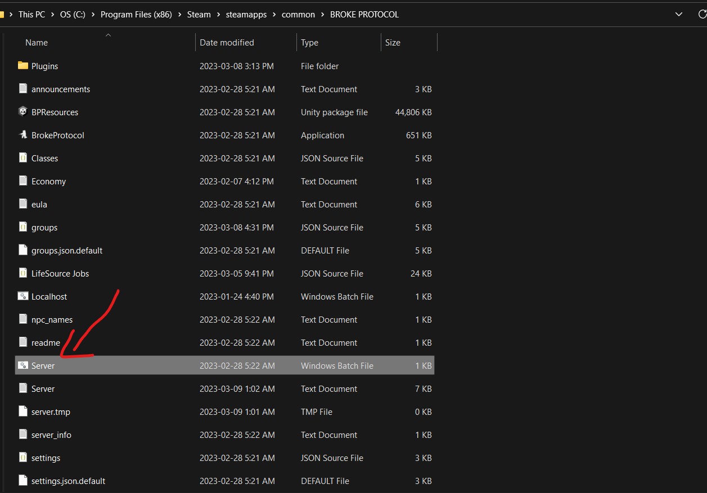

# How to host a server in BrokeProtocol
A Broke Protocol RPG multiplayer server is a customized server that adds RPG elements to the game, such as character story, missions, NPC interactions, etc. The goal is to create a more immersive experience where players can build characters, and interact with each other. Players can create their own stories, form factions. Each server has its own unique take on the RPG experience and that's cool!

- To open ports in a router for 5557-5558 UDP protocol, you can follow these steps:
  - Determine your router's IP address and log in to the router's web interface using a web browser.
  - Look for a menu item labeled "Port Forwarding," "Virtual Servers," or something similar.
  - Click the "Add" button to create a new port forwarding rule.
  - Enter a name for the rule, such as "UDP 5557-5558."
  - Set the protocol to UDP.
  - Enter the port numbers 5557-5558 in the "External Port" and "Internal Port" fields.
  - Enter the IP address of the device you want to forward traffic to in the "Internal IP" field.
  - Click "Save" or "Apply" to save the new rule.
  - It's important to note that the exact steps to open ports in a router can vary depending on the make and model of your router, so you may need to consult your router's documentation or the manufacturer's website for specific instructions.

> Edit announcements.txt, server_info.txt, settings.json, and groups.json with any text editor to configure server name, player count, map, permissions, etc.

> Get a Windows or Linux 64-bit machine/VPS with at least 2GB of RAM, good bandwidth, and decent CPU. No Linux desktop is required since the Server can run from the terminal.

# Windows

In Windows the only thing you have to do is go to the game folder `C:\Program Files (x86)\Steam\steamapps\common\BROKE PROTOCOL`, and look for a file called `Server.bat` that's for executing the server. Once you open it a CMD will be prompt, now you have to wait the server to be started and that's it, you have a server! Remember to configure the server before starting.

# Linux

There are a lot of providers for a linux host, I recomend to get a Debian VPS or a Ubuntu VPS, the price is around 10$ per month. Normally you don't have to set up an FTP (File Transfer Protocol), they already have one, so we can access to that FTP using [FileZilla](https://filezilla-project.org/) or similar, we also will need a SSH Client such as [Putty](https://www.putty.org/).

Download [Download Linux Server (x64)](https://brokeprotocol.com/download/) In the official Broke Protocol Website, and upload it to your VPS, then extract it. After extracting you will have some files. Make sure you have installed `screen` otherwise run `sudo apt-get install screen`

Make sure you're inside of the folder where you extracted the server, configure your server properly and then run it using.
- `./start.sh` (For starting the server)
- `./stop.sh` (For stopping the server)
- `tail -f Server.log` (This for monotoring the Server.log file)

- If you have permission issues run `chmod +x start.sh`

> At the moment I don't have a video for explaining how to do it.

# Host services
This is the easiest way to make a server, and doesn't require a lot of process to run a server. Some services:
- https://lordhosting.fr/en/brokeprotocol.php
- https://www.gtxgaming.co.uk/server-hosting/broke-protocol-server-hosting/
- https://zap-hosting.com/en/broke-protocol-server-hosting/
- https://arkgameserverhosting.com/broke-protocol-server-hosting/
- https://citadelservers.com/en-us/game-servers/broke-protocol-game-hosting