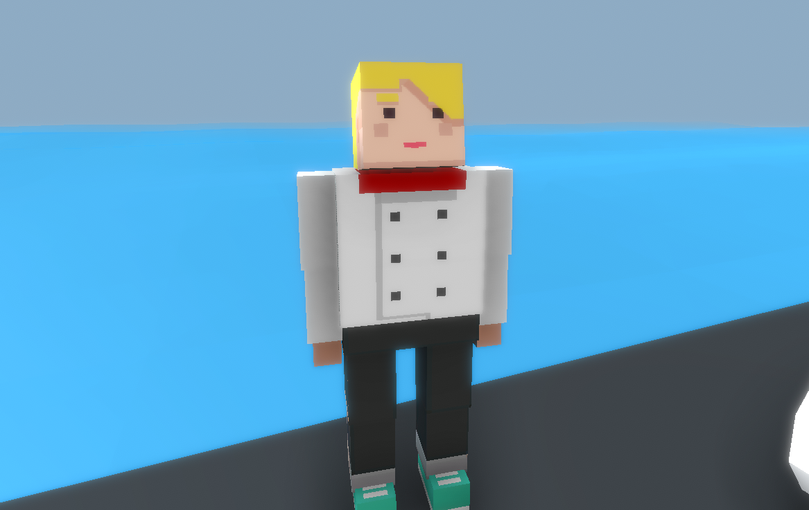
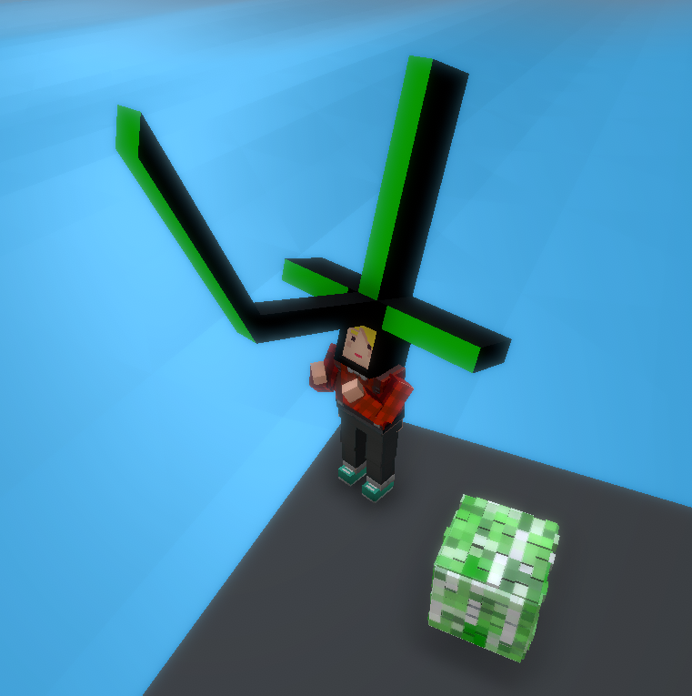

# Simple mode
This are some templates you can use for custom simple clothes [Template](https://drive.google.com/file/d/1KzQS2QG5Xr-99jGWW_l-jGkhpZVeKyY8/view?usp=sharing), choose one, edit it if you want and then follow the tutorial.

When you import it to Unity make sure to change the FilterMode to "Point" so the texture is not blur.

In my case I'll use the "CookWhite" for the example. We're going to search for a prefab, in this case I'll use the "JacketBusinessBlack", we duplicate it, then change the name of it, now we can simply create a new material and assign the CookWhite to it. Now we open the prefab and put the material we just created, change the properties you want and that's it! 

## Result

# Custom Model
First thing we have to do is to use the Humanoid.fbx, in this case we're going to duplicate, this in case we break something we don't break the default model. Next thing we have to do is to open Blender (this actually would work in any 3D modelling program but Blender is the most common), now that we have imported it we may see a little object, we're going to press "." in the numpad to zoom in. We'll see a model with it's default clothes, we're going to hide the models except the "mesh" so we can guide ourselves acording to the model. 

Now we're going to create a mesh, in this case a basic box. I'm gonna make a weird model but this is to demostrate no matter how big is the object it will work ~actually I'm lazy~. Then we're going to assign a material, if you don't know how there are videos on YouTube that might help.

Then, after all the process we're going to link the object to the bones. Click on the object first and then click on the body, cntrl + L and tranfer the data. Then we're going to only click on the object, go to modifier properties and select Armature, then we're going to assign the bone we want to attach the object to. And that's it!

You may have the problem that the object bugs then you play the animation, to fix this the only thing you have to do is select the object and then the body and transfer the data again, and that's it, fixed!

Now after exporting, we're going to look for a prefab already made that fits to the object we made (in this case a helmet), we duplicate it and then we're going to give it the mesh from the Humanoid we exported, and give its materials. Now you can modify all the other properties to whatever you want, and export it.

## Result
