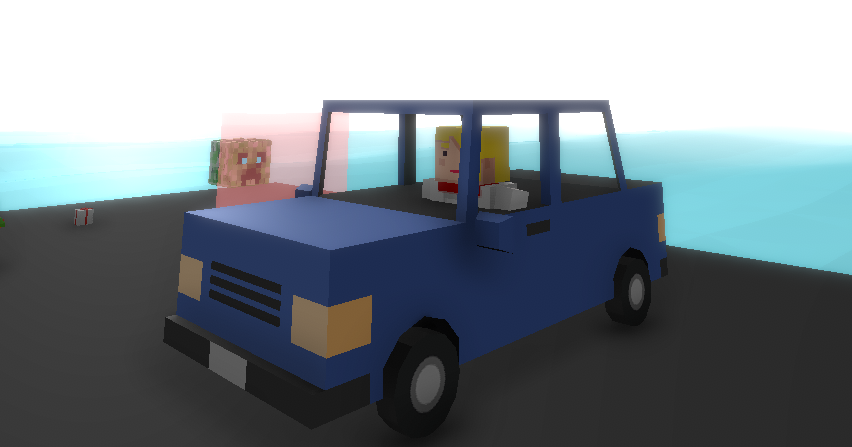

# How to make a car
To make a car you need a model with 4 wheels (2 are enough sometimes), and you're going to take a prefab that fits what you want to make, duplicate it and change the name. In my case I'm using a default model, next thing we have to do is to assign the model to the parent and the model of the wheels in the children. Now we have to assign the materials and we have the base done.

Now we have to make sure that the colliders of the wheel fits with the model of the tires, modify the radius and height, this is very important, otherwise your car will fly or something.

We also have to modify the seats, change its position, rotation, etc...

Next thing we have to do is to make sure that all the properties are set correctly: the wheels models, the wheels colliders, the seats, the health, the speed, etc...

After all that can export it, that's it!

## Result
