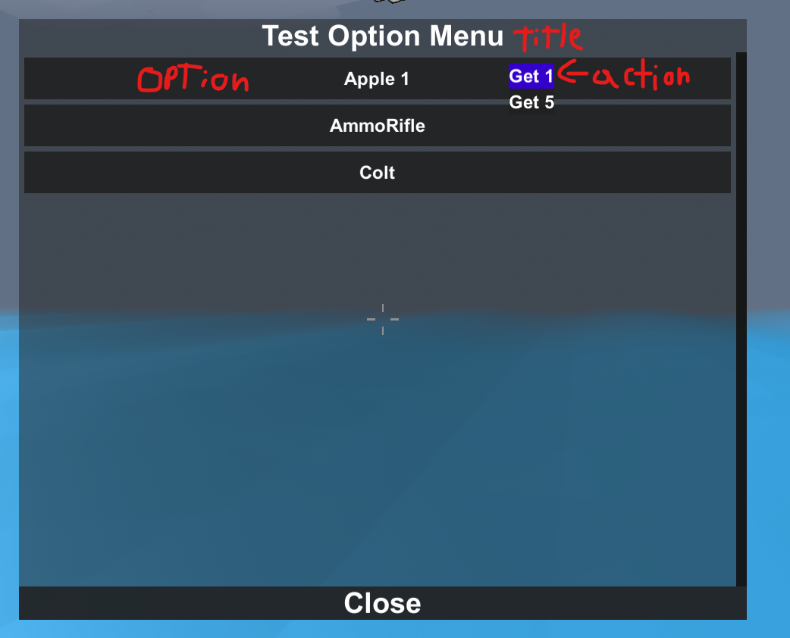

# What is this for
An option menu and input menu is an interface where we can either submit something or interact with an specific action or maybe just show some information, we can use this for making menus such as a staff moderation menu, showing player information, send messages, etc...

# Option Menus
For using them, the first thing we have to do it's to make a list of LabelIDs `options` which is basically a list that contains a label and an ID, the ID is very important, we're going to use it to interact later in an if statement or a switch statement and have different actions, we also have to make another list of LabelIDs `actions` so it will contain the actions that the `options` contain.

To identify each part of the OptionMenu:



In this case we're going to make an option menu that contains `3 options` named `Apple1` `AmmoRifle` `Colt`, and `2 actions` named `get 1` `get 5`, we have to give them an ID we can use later for identifying the actions/options. Then we're going to execute `player.svPlayer.SendOptionMenu()` give it a `title` `player ID` `optionmenuid` (this one is very important) `options to array` `actions to array`

[](src/OptionMenu.mp4 ':include :type=video controls width=100%')

```cs
public class OptionMenuGuide : IScript
{
    public OptionMenuGuide()
    {
        CommandHandler.RegisterCommand("TestOptionMenu", new Action<ShPlayer>(TestOptionMenu));
    }
    public void TestOptionMenu(ShPlayer player)
    {
        List<LabelID> options = new List<LabelID>
        {
            new LabelID("Apple 1", "apple1"),
            new LabelID("AmmoRifle", "ammorifle"),
            new LabelID("Colt", "colt")
        };
        List<LabelID> actions = new List<LabelID>
        {
            new LabelID("Get 1", "get1"),
            new LabelID("Get 5", "get5")
        };
        player.svPlayer.SendOptionMenu("Test Option Menu", player.ID, "testoptionmenu", options.ToArray(), actions.ToArray());
    }
}
```

Ok, once you have executed command the option menu will be prompt, but it doesn't have any action it doesn't work. Here is where the event `virtual bool OptionAction (ShPlayer player, int targetID, string id, string optionID, string actionID)` is used. 

What we're going to do is to use an if statement to compare if the `id` matches with `testoptionmenu` which is the ID we gave in `SendOptionMenu()` this is because a lot of plugins interacts with this event and you don't want to interrupt or bug them. 

After this we have to make either a switch statement or an if statement to compare the `optionID`, in this case we're going to use swich statement so every `case/block` will be an `option` we gave before.

Then we're going to compare the `actionID` to see what the player want to do. In this case if the `actionID` is `get1` we're going to give the player the 1 of the options he chose.

[](src/OptionMenuEvent.mp4 ':include :type=video controls width=100%')

```cs
[Execution(ExecutionMode.Event)]
public override bool OptionAction(ShPlayer player, int targetID, string id, string optionID, string actionID)
{
    if (id == "testoptionmenu")
    {
        switch (optionID)
        {
            case "apple1":
                ShItem item = SceneManager.Instance.GetEntity<ShItem>("Apple1");
                if (actionID == "get1")
                {
                    player.TransferItem(DeltaInv.AddToMe, item, 1);
                }
                else if (actionID == "get5")
                {
                    player.TransferItem(DeltaInv.AddToMe, item, 5);
                }
                break;
            case "ammorifle":
                ShItem item1 = SceneManager.Instance.GetEntity<ShItem>("AmmoRifle");
                if (actionID == "get1")
                {
                    player.TransferItem(DeltaInv.AddToMe, item1, 1);
                }
                else if (actionID == "get5")
                {
                    player.TransferItem(DeltaInv.AddToMe, item1, 5);
                }
                break;
            case "colt":
                ShItem item2 = SceneManager.Instance.GetEntity<ShItem>("Colt");
                if (actionID == "get1")
                {
                    player.TransferItem(DeltaInv.AddToMe, item2, 1);
                }
                else if (actionID == "get5")
                {
                    player.TransferItem(DeltaInv.AddToMe, item2, 5);
                }
                break;
        }
    }
    return true;
}
```

This nesting looks horrible, right? We can make it shorter and optimized. Use a bit of logic to have the less code possible but still working fine. You can set that the optionID to the exact name of the Item so you don't have to worry about a messy switch statement, but it depends very much of what you want to do.

```cs
[Execution(ExecutionMode.Event)]
public override bool OptionAction(ShPlayer player, int targetID, string id, string optionID, string actionID)
{
    if (id == "testoptionmenu")
    {
        string itemName = "";
        switch (optionID)
        {
            case "apple1":
                itemName = "Apple1";
                break;
            case "ammorifle":
                itemName = "AmmoRifle";
                break;
            case "colt":
                itemName = "Colt";
                break;
        }
        if (actionID == "get1")
        {
            player.TransferItem(DeltaInv.AddToMe, SceneManager.Instance.GetEntity<ShItem>(itemName), 1);
        }
        else if (actionID == "get5")
        {
            player.TransferItem(DeltaInv.AddToMe, SceneManager.Instance.GetEntity<ShItem>(itemName), 1);
        }
    }
    return true;
}
```

# Input Menus
Input menus are easier to use than option menus, we only have to do is send an `InputMenu` to the player and then we're going to handle what the player submited in the event.

So the first thing we have to do is to send it with `SendInputMenu()` give it a `title` `player ID` `inputmenu ID` (important) and a `ContentType` which is what kind of input you want, this can be numbers, name, password, etc...

Then in an event `virtual bool SubmitInput (ShPlayer player, int targetID, string id, string input)` we're going to compare the ID of the input menu and then we're going to use the `input` string which is what the player has submitted.

[](src/InputMenu.mp4 ':include :type=video controls width=100%')

```cs
public class InputMenuGuide : PlayerEvents
{
    public InputMenuGuide()
    {
        CommandHandler.RegisterCommand("TestInputMenu", new Action<ShPlayer>(TestInputMenu));
    }

    public void TestInputMenu(ShPlayer player)
    {
        player.svPlayer.SendInputMenu("Input Menu Test", player.ID, "inputmenutest", UnityEngine.UI.InputField.ContentType.Custom);
    }

    [Execution(ExecutionMode.Event)]
    public override bool SubmitInput(ShPlayer player, int targetID, string id, string input)
    {
        if (id == "inputmenutest")
        {
            player.svPlayer.SendGameMessage("Message sent: " + input);
        }
        return true;
    }
}
```