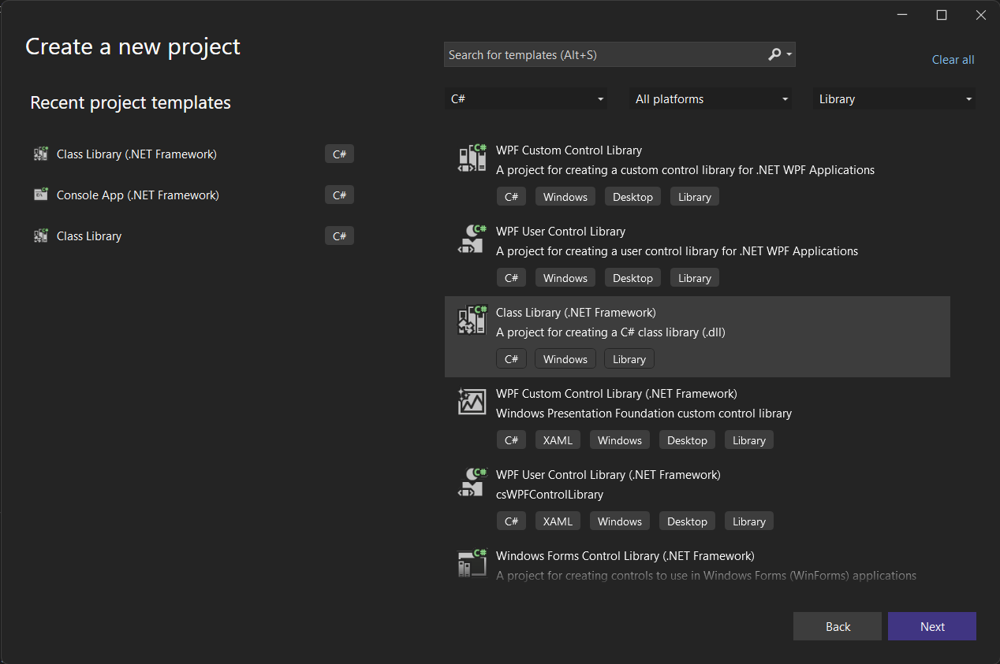
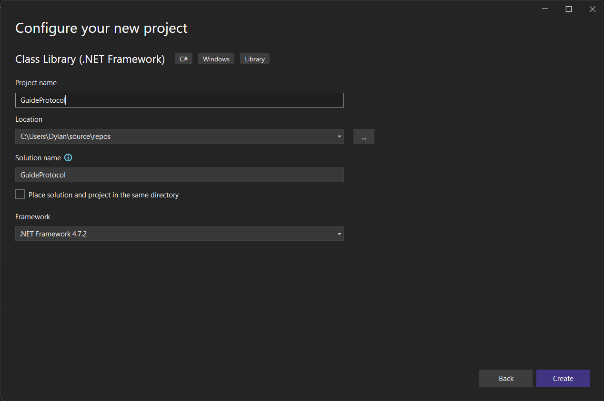
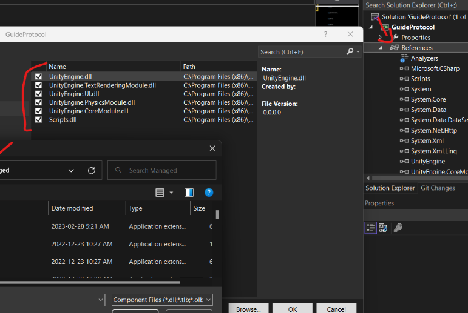

# Starting
- Open Visual Studio Community and create a new project ".NET Framework version 4.7.2", and give a name to it.




- Now we're going to add the following references to the project, so we can access to the BrokeProtocol code.
- `UnityEngine.dll`, `UnityEngine.CoreModule.dll`, `UnityEngine.PhysicsModule.dll`, `UnityEngine.TextRenderingModule`, `UnityEngine.UI.dll`, and `Scripts.dll` from the `BrokeProtocol_Data/Managed/` directory. Over the time you may add more references to use them.



# Plugin
Now it's time to create the plugin, this step is mandatory. First you have to create a class, this class can be named however you want, but normally it's named as `Core`, you also should name it like that to follow a good practice. We're going to use the namespace `BrokeProtocol.API` so we can inherit the class `Plugin`. We're going to create a constructor, and inside of it we're going to instantiate `PluginInfo` and give it the parameters `name` `groupNamespace` and `description`, and set it in the `Info` property.

`groupNamespace` is for the permissions, for example `bp.teleport`.

```cs
public class Core : Plugin
{
    public Core()
    {
        Info = new PluginInfo("ExampleName", "exn", "Example description plugin");
    }
}
```

[](src/PluginStart.mp4 ':include :type=video controls width=100%')

# IScript and Singleton
`IScript` is an interface that automatically instantiates any class in the plugin. In the other hand is to use the `Singleton` method which is normally instantiting the classes in the `Plugin` class a.k.a `Core`.

In my opinion using IScript is easier to use. Let's compare how the two look like in code.

`Singleton` Output: Test
```cs
public class Core : Plugin
{
    public static Core Instance { get; private set; }
    public Example Example { get; private set; }
    public Core()
    {
        Info = new PluginInfo("ExampleName", "exn", "Example description plugin");
        Example = new Example();
    }
}
public class Example
{
    public Example()
    {
        Debug.Log("Test");
    }
}
```

`IScript` Output: Test
```cs
public class Example : IScript
{
    public Example()
    {
        Debug.Log("Test");
    }
}
```

Use the [GameSource](https://github.com/broke-protocol/broke-protocol) to read the code and learn about it.