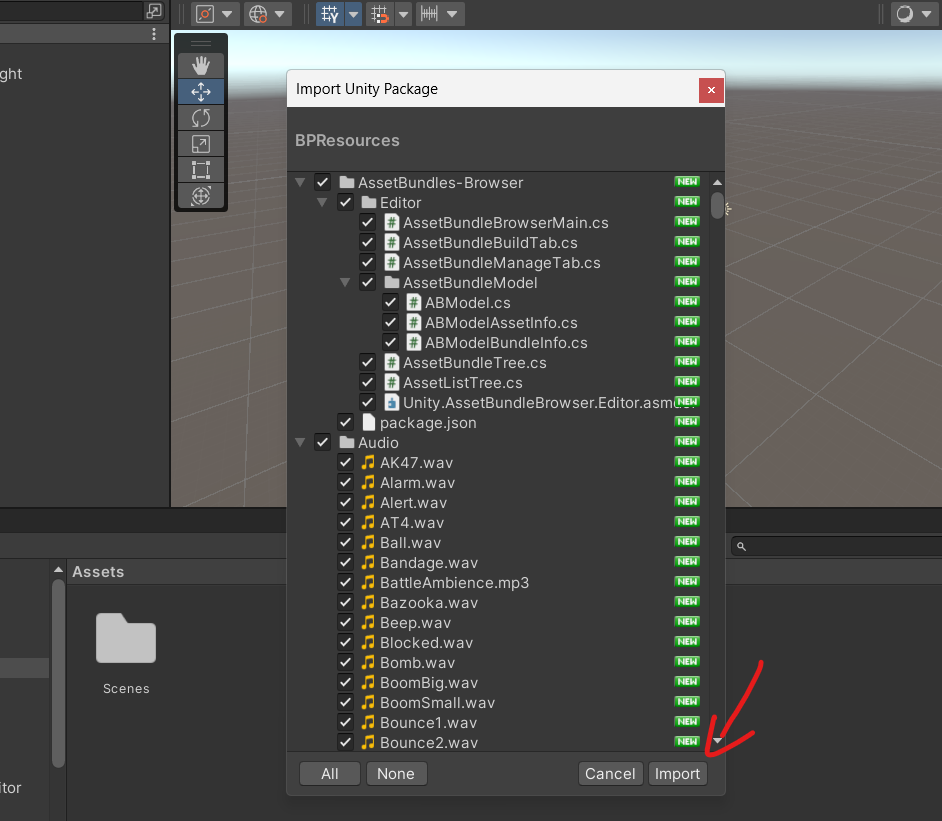

# Starting
- Open your UnityHub and create a new 3D project. 

- Once created this should be the interface of Unity.

- The first thing we have to do it's import the BPResources package from the game directory. Assets>Import Package>Custom Package.

- As a result of importing the package you will have more folders that contains different kind of objects, assets, prefabs, models, animations, etc...
  - The folder "ExportEntities" is very important because it contains most of the objects of the game, and it is useful if you want to just modify it or duplicate an object and just change it's properties.
  - Most of the default models comes from Synty Studios, so if you want models that seems like the game you can take a look to those assets. [Unity Synty](https://assetstore.unity.com/publishers/5217)
  - [NongBenz's Tutorial](https://brokeprotocol.com/modding-guide/)

# Making a simple object
> Before making the object, I created a folder named "GuideProtocol" to separate the objects and have a more organized and structured project.

It's important to know that we have to think about what our object will be, it's going to be a consumable, item, weapon, clothe or a simple static object.

In this case we're going to make a simple static object, which is basically an object that only contains the model and its collider. I have a model of a hamburger. What we're going to do is create a new game object/prefab, add the components "Mesh filter" and "Mesh renderer", and at the end we're going to add a collider, the collider can be a simple collider or a mesh collider.

Now that we know how to make a simple object, now we can make an item consumable. There are two options, you can either add the properties of an item to a simple object or you can duplicate a prefab of an item (that has the properties that you want) and just add the model to it and change it properties. The latter is the easiest one, so lets go for that one.

The same logic can be applied with the rest of the objects, here is a tutorial for making a car. [Tutorial link](https://www.youtube.com/watch?v=BmMhT-ZT094)

# Exporting to BPA (Broke Protocol Asset)
For exporting an object in Unity to BrokeProtocol we have to add it to an assetbundle, and then export it in Broke Protocol Asset Export.

This is how it looks in game, bigger than expected because I didn't measure the size.

